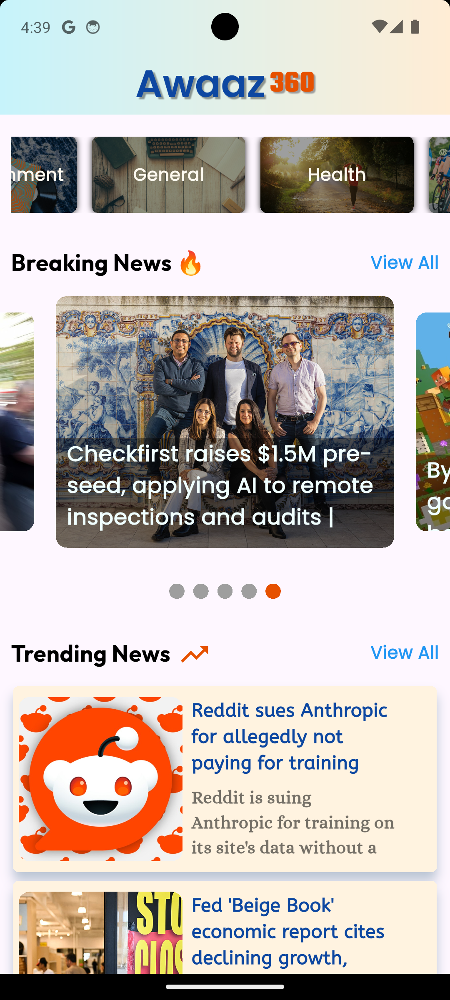

# Awaaz360 - News App

A Flutter-based news application designed to provide users with up-to-date news from various categories.

## About Awaaz360

Awaaz360 is a dynamic news application developed using **Flutter** and **Dart language**. It's powered by **robust backend API integration**, fetching the latest news to keep you informed with real-time updates.

---

## ✨ Features

* **Categorized News View:** Browse news articles organized into various categories such as Science, Entertainment, Health, Technology, Sports, and more!
* **Breaking News Section:** Stay on top of the most important and urgent developments with a dedicated section for breaking news alerts.
* **Trending News Feed:** Discover popular and widely discussed news articles that are currently captivating public interest.
* **Intuitive User Interface:** Designed for a seamless, engaging, and easy-to-navigate news reading experience.
* **API Powered Content:** Efficiently fetches fresh news content from reliable backend APIs, ensuring timely information delivery.

---

## 🛠️ Tech Stack

| Tech                  | Description                                            |
| :-------------------- | :----------------------------------------------------- |
| **Flutter** | Cross-platform UI toolkit for natively compiled applications |
| **Dart** | Programming language optimized for UI                  |
| **News API** | For fetching real-time news data                       |
| **Clean Architecture**| Ensures separation of concerns, scalability, and maintainability |
| **HTTP/Dio** | For network requests and API communication             |
| **Flutter Widgets** | For building responsive and intuitive UI elements      |

---

## 📸 Screenshots

<p align="center">

 &nbsp; &nbsp; &nbsp;  &nbsp; &nbsp; &nbsp; 

<br>

Onboarding Page &nbsp; &nbsp; &nbsp;&nbsp; &nbsp; &nbsp; &nbsp; &nbsp; &nbsp; &nbsp; &nbsp; &nbsp;&nbsp; &nbsp; &nbsp; &nbsp; &nbsp; &nbsp; &nbsp; &nbsp; &nbsp;&nbsp; &nbsp; &nbsp; &nbsp; &nbsp; &nbsp; &nbsp;  &nbsp; &nbsp; Home Page &nbsp; &nbsp; &nbsp;&nbsp; &nbsp; &nbsp; &nbsp; &nbsp; &nbsp; &nbsp; &nbsp; &nbsp;&nbsp; &nbsp; &nbsp; &nbsp; &nbsp; &nbsp; &nbsp; &nbsp; &nbsp;&nbsp; &nbsp; &nbsp; &nbsp; &nbsp; &nbsp; &nbsp;  &nbsp; &nbsp; Filter by Category Page

</p>

---

## 🚀 Getting Started

1.  **Clone the repository**
    ```bash
    git clone [https://github.com/darshh009/flutter-awaaz360-news-app.git](https://github.com/darshh009/flutter-awaaz360-news-app.git)
    cd flutter-awaaz360-news-app
    ```
2.  **Install dependencies:**
    ```bash
    flutter pub get
    ```
3.  **Run the app:**
    ```bash
    flutter run
    ```

---

## 📧 Contact

For any questions or inquiries, feel free to reach out via email: **darshhwork@gmail.com**

---

## 📚 Sources

* [News API Documentation](https://newsapi.org/docs)
* [Flutter Documentation](https://docs.flutter.dev/)
* [Dart Language Guide](https://dart.dev/guides)

---
